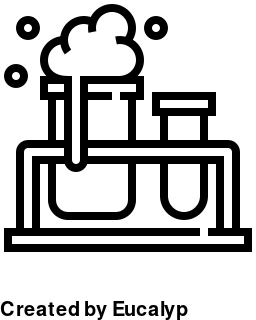
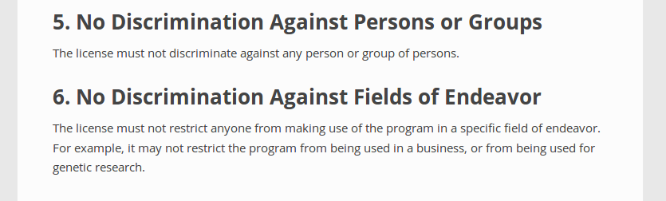
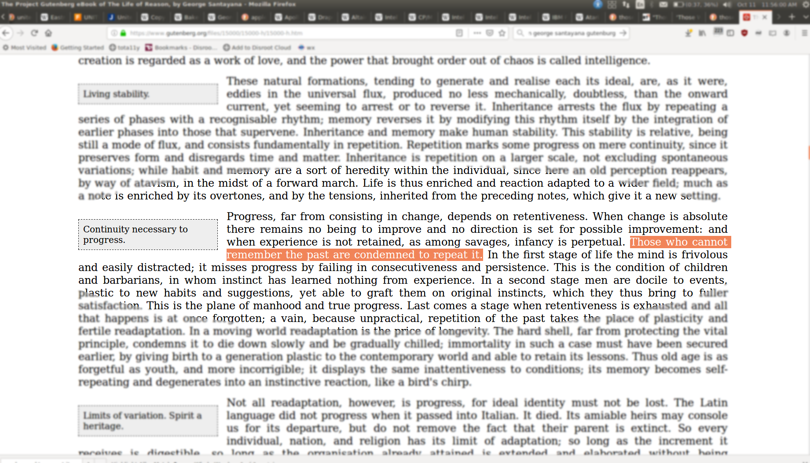
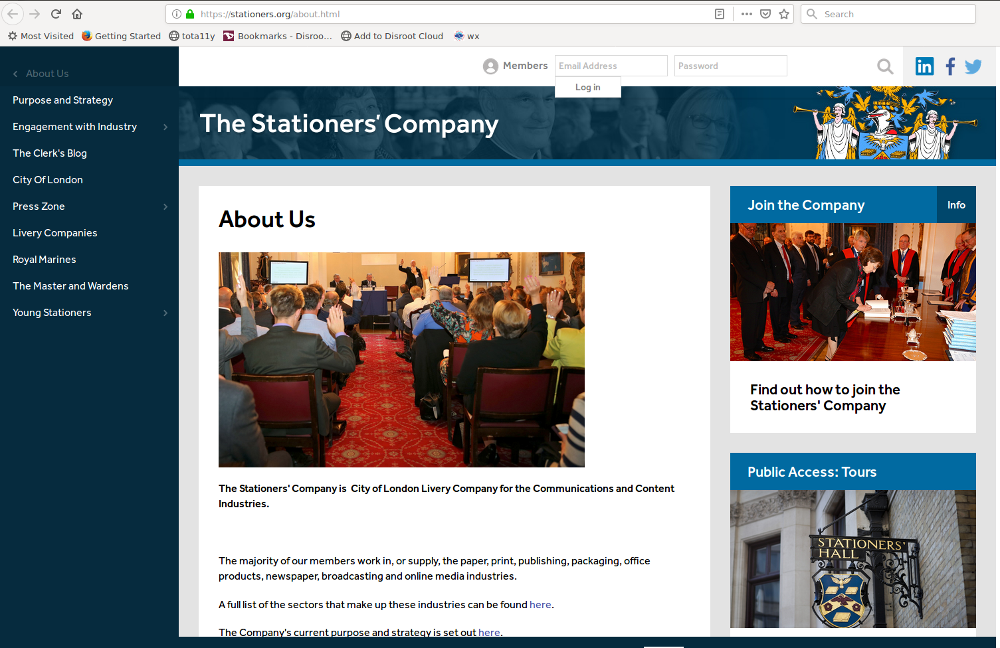
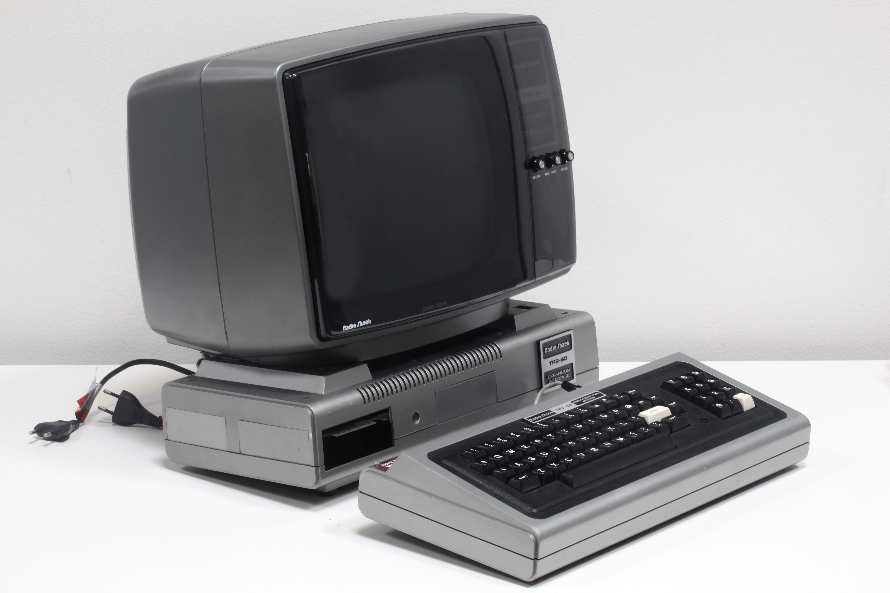
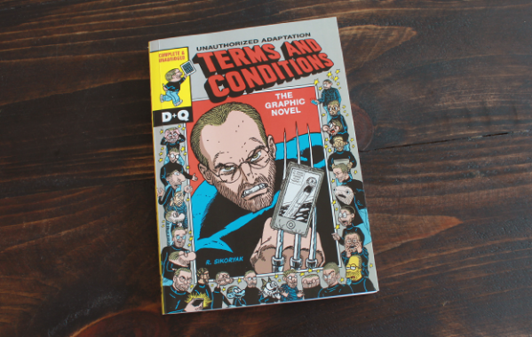
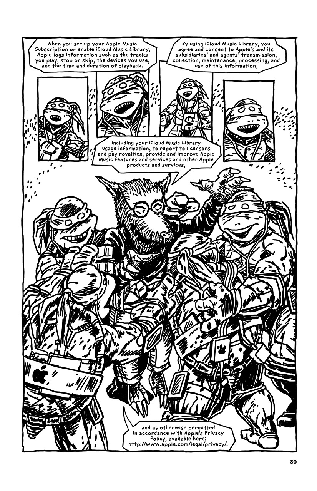

:title: History of FOSS
:css: iat-style.css

---- 

.. note: (Name and title slide)

Free & Open Source Software History
====================================
An opinionated re-appraisal
---------------------------

D\. Joe Anderson
................

RITLUG
October 2019

.. note:: running heads:
          FOSS History, RITLUG, 2019-10-11

----

----

HFOSS
=====

MWF 9am

Spring 2020 

---- 

IANALATDNCLOFA
==============

.. note:: These sorts of discussions often turn into "but what if I ...?" 
          and "can I do this" and so on.
          I like to play speculation games as much as the next person, and
          We can talk about these things in general terms. BUT do not rely on 
          what I say as advice for licensing your own work or using that of others.

---- 

Terminology note
================

.. note:: People occasionally try to come up with different ways of doing or saying
          largely the same thing.

.. image:: images/standards.png
    :height: 283px
    :width: 500px

.. note: standards.png PNG 500x283 500x283+0+0 8-bit sRGB 256c 24.3KB 0.000u 0:00.000
.. note: https://imgs.xkcd.com/comics/standards.png
.. note: https://xkcd.com/927/

XKCD_

.. _XKCD: https://xkcd.com/927/

---- 

Terminology note
================

 - *copyfree*

 - *public software*

 - *free, libre, and open source software* (FLOSS)

 - *free and open source software* (FOSS)   <----   

 - *open source*

 - *free software*

Think **free** as in **freedom** rather than  *available at no (additional) cost*.

.. note:: These terms are used differently within the field to indicate
          differences in philosophy or approach that are too abstruse to get
          into for a general audience.  Of course I have opinions about all
          of this and would love to talk about it, but to do so would keep us
          from the fundamentals.  I'll generally use "free software" or "FOSS
          but usually the other terms would do. Newcomer: *copyfree*

---- 

What is "software freedom"?
===========================

.. note:: Very briefly, for now. Heard of the 3Rs?. cf Four freedoms, 5Rs of
          open content.  3 Rs only work if you misspell them, which I guess
          is part of the joke: You need to go to school to make that right.

The 4 R's
---------

----

*What is "software freedom"?*

The 4 R's
---------

 - **Run**
 - **Read**
 - **Revise**
 - **Redistribute**

.. note::  I've managed to come up with a list of words that begin with R when properly spelled.
           In the interest of time I won't belabor them for this crowd 
           unless there are questions.

.. note:: Anyone can run it for any purpose. Contrast with, eg, Apple
          software on Apple hardware.  Apple HW and OS have changed a lot
          over the years, to run in emulation still legally requires a
          license. Video game console emulation. Only a student. Only in
          education. Only one copy. Only one computer or device. Only one
          CPU. Only if you are a good person ....

----

*What is "software freedom"?*

.. image:: images/Screenshot_from_2017-10-17_15-24-23-osd-small.png

.. note:: A much longer list, of 10 instead of 4. One of many ways of trying to explicitly describe freedoms. For
          now, want to focus on a couple of points here.

---- 

*What is "software freedom"?*

.. note:: For now, want to focus on a couple of points here behind "freedom to
          run".  A lot packed into that 3 letter word.

.. note:: cf DFSG

.. note:: By read we mean the human-readable form of software, that previous
          had been written by a human doing a thing we tend to refer to as
          *programming* or more lately as *developing*.  We call that human
          readable stuff "source code" hence "open source".  Study, learn,
          understand, criticize.

.. note:: This is where academic values really come into play.  Beware some
          licenses, what I call "academicware", that let you use it as a
          student or faculty member, but not once you get a job, or let you
          work with industry or government collaborators.  Personal use
          only, etc.

.. note:: Correct, debug, improve, repurpose. Do you understand it well enough to
           change it? Can you keep using it on different OSes or hardware?
           Fighting bitrot.

.. note:: Share. Verbatim or changed. Upstream or downstream. Beware "must
           submit upstream" terms. Free and easy, cf code escrow.

---- 

What is "software freedom"?
===========================

 - **Run**
 - **Read**
 - **Revise**
 - **Redistribute**

.. note: A brief preview of an idea we'll expand on later, bears repeating because it's the essence of the subject.

.. note:: Or, to put it most briefly, the essential freedom for FOSS is the
          freedom to fork.

**Freedom to** *fork*

.. note: In the most simple terms, the essence of free software and free culture is the **freedom to fork**, which is to say, to take a work, make a copy of it, and work on it as if it were your own.

.. note: and to make or improve works with the intention of allowing others also to fork

.. note: This broadens what can be done with any given work, and it broadens who can do it.

.. note: There's something counter-intuitive here, almost a paradox, that I think
         academics in particular get wrong: Sure, this enables the lone
         genius to go off and reshape or recreate something from the pieces
         and parts from various projects.  Going in the other direction,
         though, the freedom to go off and do your own thing is crucial to
         creating the conditions for the kind of meaningful, sustainable
         collaboration and cooperation that is so crucial for so much
         academic work.

.. note:  Slide with 4 R's listed (the What)

.. note: Slide with IP categories listed. (the Why) ok maybe not

---- 

 **proprietary** vs **commercial**

.. note:: *Freedom* not *price*. MYTHBUSTING The opposite of free software is
          proprietary software. One occasionally sees people try to
          distinguish betwee this kind of software and commercial software,
          but that's not a clean distinction: Google uses FOSS, and it's
          definitely commercial. Redhat's $2B annual take is a pittance
          compared to what Google brings in, but Redhat is also very much
          commercial.

---- 

 **copyleft** vs **non-reciprocal**

.. note:: both are free software and open source

---- 

https://www.gutenberg.org/files/15000/15000-h/15000-h.htm

.. note:: images/santayana-gutenberg-blur.png PNG 1841x1054 1841x1054+0+0 8-bit sRGB 734KB 0.000u 0:00.000

----

Stationer's Guild (1403)
========================

https://en.wikipedia.org/wiki/Worshipful_Company_of_Stationers_and_Newspaper_Makers

https://stationers.org/about.html

        
---- 

https://www.teachingcopyright.org/download/tc_law_and_technology_timeline.pdf

https://www.teachingcopyright.org/resources.html#tc_handouts

.. image:: images/teaching-copyright.png
   :height: 461px
   :width: 459px

.. note:: images/teaching-copyrigh.png PNG 917x942 917x942+0+0 8-bit sRGB 187KB 0.000u 0:00.000

----

https://en.wikipedia.org/wiki/Ad_hominem

https://en.wikipedia.org/wiki/Argument_from_authority

----

Your fave is problematic
========================

https://yourfaveisproblematic.tumblr.com/nowwhat

*Am I still allowed to like them?*

Yes. No one is stopping you from doing anything. You can like and consume their work without liking them as a person. [...]

*How can I be a good fan?*

Try and make them a better person. If they do something problematic, call them out on it.  [...]

*How can I be a conscious fan?*

Recognize that they did something wrong. Accept it. Don’t try to defend it or explain it. Say “so-and-so makes great music, but I wish they weren’t racist” or [...]

.. note: Nobel Prizes announced just this week. Nobel in Literature is said 
         to have ties to people who did horrible things in the wars in the former 
         Yugoslavia like Slobodan Milosevic

---- 

Rob Landley
===========

https://en.wikipedia.org/wiki/BusyBox

*Linux Weekly News: Richard Stallman resigns from the FSF* 

https://lwn.net/Articles/799375/

  but the Berne convention didn't extend copyright to cover source code until about 1977, and _binaries_ were considered "just a number" and uncopyrightable until the Apple vs Franklin legal decision in 1983. before that there was no common word for "free software" because there was no NON-FREE software. It hadn't been invented yet.

.. note:: Except that bundling software with hardware was something that 
          declined rapidly from 1969 or 1970 US v. IBM, Honeywell v. Sperry, 3rd party 
          competition

----

https://en.wikipedia.org/wiki/Richard_Stallman#Events_leading_to_GNU

  In 1980, Stallman and some other hackers at the AI Lab were refused access to the source code for the software of a newly installed laser printer, the Xerox 9700. Stallman had modified the software for the Lab's previous laser printer (the XGP, Xerographic Printer), so it electronically messaged a user when the person's job was printed, and would message all logged-in users waiting for print jobs if the printer was jammed. Not being able to add these features to the new printer was a major inconvenience, as the printer was on a different floor from most of the users. This experience convinced Stallman of people's need to be able to freely modify the software they use.

----

Rights and restrictions
=======================

----

*Rights and restrictions*

**Rights without restrictions**

  - public domain

.. note:: eg GRASS

**Rights for some, restrictions for others**

  - trade secret 
  - patent
  - copyright 
  - trademark

**US v. IBM 1969**

... which require *licenses* (mostly).

.. note: this is a broad overview of the area often referred to as IP & the existence of
         these is the reason we have to worry about this, can't just say "I
         don't care what someone does why do I have to bother with all this"
         or "I just want to use it for this one little thing, I don't see
         what the big deal is."

.. note: mostly means NDA, contracts, right-of-first-sale.

.. note:: Who can get the rights, who gets limited by them
.. note:: What is covered by what restrictions
.. note:: Why create restrictions
.. note:: Where do these restrictions apply
.. note:: When and how does it expire
.. note:: How and when does something become covered

---- 

Frank Karlitschek
=================

https://karlitschek.de/2019/08/open-source-if-more-than-licenses/

  His idea was that users and developers should be in control of the computer they own which requires Free Software.

.. note:: this is wrong. Free software arose in the era before widespread ownership of 
          computing hardware, and certainly before hardware capable of running 
          UNIX-like operating systems reasonably well existed.

----

https://en.wikipedia.org/wiki/TRS-80#/media/File:Radioshack_TRS80-IMG_7206.jpg

.. note:: images/Radioshack_TRS80-IMG_7206.jpg JPEG 5616x3744 5616x3744+0+0 8-bit sRGB 1.16MB 0.160u 0:00.160

----

http://www.radioshackcatalogs.com/html/catalogs_extra/electronics_1981_fall/hr020.html

----

https://en.wikipedia.org/wiki/Timex_Sinclair_1000#/media/File:Timex_Sinclair_1000_FL.jpg

----

https://en.wikipedia.org/wiki/Intel_80286 1982 to 1991

https://en.wikipedia.org/wiki/Intel_80386 1985 to 2007

https://en.wikipedia.org/wiki/Intel_80486 1989 to 2007

1991 

----

UNIX ~1970

US v. IBM 1969-1982

Honeywell v. Sperry <= 1973

Copyright Act of 1976

Dole-Bayh Act ~1981

Bell System breakup 1982 

386BSD <= 1992

MINIX 1987

---- 

Peter Levine
============

https://en.wikipedia.org/wiki/Peter_Levine_(venture_capitalist)

https://a16z.com/2019/10/04/commercializing-open-source/

 In 1998, the Open Software Initiative coined the term “open source,” and around that time, the first real business model emerged with RedHat, MySQL, and many others doing paid support and services on top of free software.

.. note:: https://a16z.com/2014/02/14/why-there-will-never-be-another-redhat-the-economics-of-open-source/

---- 

Redhat
======

https://en.wikipedia.org/wiki/Red_Hat

Founded in **1993**

https://en.wikipedia.org/wiki/Red_Hat_Enterprise_Linux

RHEL **2000** (post dotcom bust)

---- 

Cygnus
======

https://en.wikipedia.org/wiki/Cygnus_Solutions

  Cygnus Solutions, originally Cygnus Support, was founded in 1989 by John Gilmore, Michael Tiemann and David Henkel-Wallace to provide commercial support for free software. Its tagline was: Making free software affordable.

**1989**

  On November 15, 1999, Cygnus Solutions announced its merger with Red Hat, and ceased to exist as a separate company in early 2000.

https://en.wikipedia.org/wiki/World_Wide_Web

----

.. note:: Excerpt from Constitution

Patent and Copyright Clause 
===========================
U.S. Constitution 
-----------------

[The Congress shall have power] "To promote the **progress of science and useful arts**, by securing for **limited times** to **authors and inventors** the **exclusive right** to their respective **writings and discoveries**."

*Article I Section 8. Clause 8*

----

Patent and Copyright Clause 
===========================
Summarized
----------

 - *Who?* **authors & inventors**
 - *What?* **writings & discoveries**   
 - *Why?* **progress** 
 - *When?* **limited time**
 - *How?* **exclusive rights**

.. note:: This is US federal jurisdiction. Used to be more localized, with
          state and even local law in the US weighing in.  Now
          internationalized and harmonized through for instance the Berne
          Convention (US 1989), though still with differences from
          country-to-country.

---- 

*Rights and restrictions*

End User License Agreement
--------------------------

Robert Sikoryak_ 

.. _Sikoryak: https://en.wikipedia.org/wiki/Robert_Sikoryak

.. note: https://www.drawnandquarterly.com/sites/default/files/styles/creation-gallery/public/images/creations/gallery/Terms%20and%20Conditions/terms_1.png?itok=6XB4lN40

.. note: https://itunestandc.tumblr.com/

---- 

.. note: RRL gives rise to things like this
.. note: 108 pages, graphic novel unabridged version at the time of his writing it

.. note: TMNT https://itunestandc.tumblr.com/image/134588049070 
.. note: https://78.media.tumblr.com/96c42c8373049e01f5a83c0f606e207c/tumblr_nyqn70RGPx1ugej69o1_1280.jpg

---- 

.. note: MLP https://itunestandc.tumblr.com/image/133927463577 
.. note: https://78.media.tumblr.com/4257efd86ce979895d533f42798fac8e/tumblr_ny6cfwI3WS1ugej69o1_1280.jpg

.. image:: images/tumblr_ny6cfwI3WS1ugej69o1_1280.jpg
    :height: 950px
    :width: 450px

.. note: images/tumblr_ny6cfwI3WS1ugej69o1_1280.jpg JPEG 825x1275 825x1275+0+0 8-bit Gray 256c 394KB 0.000u 0:00.000
.. note: images/tumblr_nyqn70RGPx1ugej69o1_1280.jpg[1] JPEG 825x1275 825x1275+0+0 8-bit Gray 256c 452KB 0.000u 0:00.000

.. note:: copyright: for authors
    applies to creative expression (very broadly: literature, art. cf djb vs us)
    not for facts or automatic work (cf phone books, databases)
    arises automatically (per Berne vide supra) on creation
    can be registered: damages vs injunctive relief
    life of author plus 70 (120 from creation, 95 from pub. Up from 14x2)
    not for US govt (cf Crown Copyright and OSM)
    limited by fair use (do ToS override fair use?)
 
.. note:: trade secret, in principle for ever, cumbersome, rev eng, Coke formula
.. note:: patent, 20 years, first to file, prior art, novel, practical, must apply
.. note:: trademark, logos and brand names, start by using, protects consumers from "confusion", must defend from becoming generic. Xerox. Kleenex. Hoover.
.. note:: public domain, US federal govt (but not UK!) works not copyrightable, when copyright, patent expires, trademark becomes generic.

.. note:: Slide highlighting just copyright.

.. note:: but where do these come from?

---- 

.. note:: Freedom to fork: Reprise

What do we want?
================

** software freedom! **

How do we get it?
-----------------

** licenses? **

.. note:: By using the idea of a license expansively, to protect rights.  In
          our current legal climate, we can tell a piece of software has
          been liberated by its authors when it has a license that allows us
          *effectively* to run, read, revise, and redistribute the source
          code.

---- 

Free software licenses
======================

.. note: compare and contrast with proprietary EULAs

For software

 * Permissive, non-reciprocal

   * MIT expat or X11

   * BSD 2-clause or 3-clause

   * Apache

   * WTFPL

 * Copyleft

   * varieties of the GPL

   * Oracle (via Sun) CDDL

---- 

.. image:: images/Screenshot_from_2017-10-17_15-28-35-fsf-mit-expat.png

.. note:    :height: 283px
.. note:    :width: 500px

----

.. note:: Excerpt from Constitution

Patent and Copyright Clause 
===========================
U.S. Constitution 
-----------------

[The Congress shall have power] "To promote the **progress of science and useful arts**, by securing for **limited times** to **authors and inventors** the **exclusive right** to their respective **writings and discoveries**."

*Article I Section 8. Clause 8*

----

Patent and Copyright Clause 
===========================
Summarized
----------

 - *Who?* **authors & inventors**
 - *What?* **writings & discoveries**   
 - *Why?* **progress** 
 - *When?* **limited time**
 - *How?* **exclusive rights**

.. note:: This is US federal jurisdiction. Used to be more localized, with
          state and even local law in the US weighing in.  Now
          internationalized and harmonized through for instance the Berne
          Convention (US 1989), though still with differences from
          country-to-country.

---- 

*Rights and restrictions*

End User License Agreement
--------------------------

Robert Sikoryak_ 

.. _Sikoryak: https://en.wikipedia.org/wiki/Robert_Sikoryak

.. note: https://www.drawnandquarterly.com/sites/default/files/styles/creation-gallery/public/images/creations/gallery/Terms%20and%20Conditions/terms_1.png?itok=6XB4lN40

.. note: https://itunestandc.tumblr.com/

---- 

.. note: RRL gives rise to things like this
.. note: 108 pages, graphic novel unabridged version at the time of his writing it

.. note: TMNT https://itunestandc.tumblr.com/image/134588049070 
.. note: https://78.media.tumblr.com/96c42c8373049e01f5a83c0f606e207c/tumblr_nyqn70RGPx1ugej69o1_1280.jpg

---- 

.. note: MLP https://itunestandc.tumblr.com/image/133927463577 
.. note: https://78.media.tumblr.com/4257efd86ce979895d533f42798fac8e/tumblr_ny6cfwI3WS1ugej69o1_1280.jpg

.. image:: images/tumblr_ny6cfwI3WS1ugej69o1_1280.jpg
    :height: 950px
    :width: 450px

.. note: images/tumblr_ny6cfwI3WS1ugej69o1_1280.jpg JPEG 825x1275 825x1275+0+0 8-bit Gray 256c 394KB 0.000u 0:00.000
.. note: images/tumblr_nyqn70RGPx1ugej69o1_1280.jpg[1] JPEG 825x1275 825x1275+0+0 8-bit Gray 256c 452KB 0.000u 0:00.000

.. note:: copyright: for authors
    applies to creative expression (very broadly: literature, art. cf djb vs us)
    not for facts or automatic work (cf phone books, databases)
    arises automatically (per Berne vide supra) on creation
    can be registered: damages vs injunctive relief
    life of author plus 70 (120 from creation, 95 from pub. Up from 14x2)
    not for US govt (cf Crown Copyright and OSM)
    limited by fair use (do ToS override fair use?)
 
.. note:: trade secret, in principle for ever, cumbersome, rev eng, Coke formula
.. note:: patent, 20 years, first to file, prior art, novel, practical, must apply
.. note:: trademark, logos and brand names, start by using, protects consumers from "confusion", must defend from becoming generic. Xerox. Kleenex. Hoover.
.. note:: public domain, US federal govt (but not UK!) works not copyrightable, when copyright, patent expires, trademark becomes generic.

.. note:: Slide highlighting just copyright.

.. note:: but where do these come from?

---- 

.. note:: Freedom to fork: Reprise

What do we want?
================

** software freedom! **

How do we get it?
-----------------

** licenses? **

.. note:: By using the idea of a license expansively, to protect rights.  In
          our current legal climate, we can tell a piece of software has
          been liberated by its authors when it has a license that allows us
          *effectively* to run, read, revise, and redistribute the source
          code.

---- 

Free software licenses
======================

.. note: compare and contrast with proprietary EULAs

For software

 * Permissive, non-reciprocal

   * MIT expat or X11

   * BSD 2-clause or 3-clause

   * Apache

   * WTFPL

 * Copyleft

   * varieties of the GPL

   * Oracle (via Sun) CDDL

---- 

.. image:: images/Screenshot_from_2017-10-17_15-28-35-fsf-mit-expat.png

.. note:    :height: 283px
.. note:    :width: 500px

