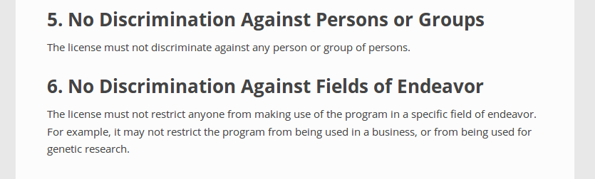

:title: FOSS Concepts Intro
:author: D. Joe Anderson
:css: iat-style.css

---- 

.. note: (Name and title slide)

Free & Open Source Software Concepts
====================================
A brief introduction
--------------------

D\. Joe Anderson
................

University of Rochester
October 2017

.. note:: running heads:

.. note:: FOSS Concepts Intro GIS XYZ

---- 

I am not a lawyer.

----

Rough outline
=============

 - Software freedom: What is it?

 - Motivations vs legal restrictions

 - Expanding rights: Licensing

 - Example projects

.. note:: In this talk I hope to give a quick summary of what we mean by
         software freedom, to provide background for the legal conditions
         that require us to take specific steps to exercise those rights;
         followed by a quick look at the legal tools to help protect those
         rights, and then to apply those to a relevant example or two.

----

Terminology note
================

.. note:: People occasionally try to come up with different ways of doing or saying
          largely the same thing.

.. image:: images/standards.png
    :height: 283px
    :width: 500px

.. note: standards.png PNG 500x283 500x283+0+0 8-bit sRGB 256c 24.3KB 0.000u 0:00.000
.. note: https://imgs.xkcd.com/comics/standards.png
.. note: https://xkcd.com/927/

https://xkcd.com/927/

---- 

Terminology note
================

 - *free software*

 - *open source*

 - *free and open source software* (FOSS)

 - *free, libre, and open source software* (FLOSS)

 - *public software*

Think **free** as in **freedom** rather than  *available at no (additional) cost*.

.. note:: These terms are used differently within the field to indicate
          differences in philosophy or approach that are too abstruse to get
          into for a general audience.  Of course I have opinions about all
          of this and would love to talk about it, but to do so would keep us
          from the fundamentals.  I'll generally use "free software" or "FOSS
          but usually the other terms would do. Newcomer: *copyfree*

---- 

What is "software freedom"?
===========================

.. note:: Very briefly, for now. Heard of the 3Rs?. cf Four freedoms, 5Rs of
          open content

The 4 R's
---------

----

*What is "software freedom"?*

The 4 R's
---------

 - **Run**
 - **Read**
 - **Revise**
 - **Redistribute**

----

*What is "software freedom"?*

Run
---

.. note:: Anyone can run it for any purpose. Contrast with, eg, Apple
          software on Apple hardware.  Apple HW and OS have changed a lot
          over the years, to run in emulation still legally requires a
          license. Video game console emulation.

----

*What is "software freedom"?*

.. image:: images/Screenshot_from_2017-10-17_15-24-23-osd-small.png

.. note:: One of many ways of trying to explicitly describe freedoms. For
          now, want to focus on a couple of points here.

---- 

*What is "software freedom"?*

.. note:: For now, want to focus on a couple of points here behind "freedom to
          run".  A lot packed into that 3 letter word.

.. note:: cf DFSG

----

*What is "software freedom"?*

*Run*

Read
----

.. note:: By read we mean the human-readable form of software, that previous
          had been written by a human doing a thing we tend to refer to as
          *programming* or more lately as *developing*.  We call that human
          readable stuff "source code" hence "open source".  Study, learn,
          understand, criticize.

.. note:: This is where academic values really come into play.  Beware some
          licenses, what I call "academicware", that let you use it as a
          student or faculty member, but not once you get a job, or let you
          work with industry or government collaborators.  Personal use
          only, etc.

----

*What is "software freedom"?*

*Run*

*Read*

Revise
------

.. note:: Correct, debug, improve, repurpose. Do you understand it well enough to
           change it? Can you keep using it on different OSes or hardware?
           Fighting bitrot.

----

*What is "software freedom"?*

*Run*

*Read*

*Revise*

Redistribute
------------

.. note:: Share. Verbatim or changed. Upstream or downstream. Beware "must
           submit upstream" terms. Free and easy, cf code escrow.

---- 

What is "software freedom"?
===========================

 - **Run**
 - **Read**
 - **Revise**
 - **Redistribute**

.. note: A brief preview of an idea we'll expand on later, bears repeating because it's the essence of the subject.

.. note:: Or, to put it most briefly, the essential freedom for FOSS is the:

**Freedom to *fork***

.. note: In the most simple terms, the essence of free software and free culture is the **freedom to fork**, which is to say, to take a work, make a copy of it, and work on it as if it were your own.

.. note: and to make or improve works with the intention of allowing others also to fork

.. note: This broadens what can be done with any given work, and it broadens who can do it.

.. note: There's something counter-intuitive here, almost a paradox, that I think
         academics in particular get wrong: Sure, this enables the lone
         genius to go off and reshape or recreate something from the pieces
         and parts from various projects.  Going in the other direction,
         though, the freedom to go off and do your own thing is crucial to
         creating the conditions for the kind of meaningful, sustainable
         collaboration and cooperation that is so crucial for so much
         academic work.

.. note:  Slide with 4 R's listed (the What)

.. note: Slide with IP categories listed. (the Why) ok maybe not

---- 

Software freedom: 
=================
Practical constraints
---------------------
Rights and restrictions
.......................

----

*Rights and restrictions*

**Rights without restrictions**

  - public domain

.. note:: eg GRASS

**Rights for some, restrictions for others**

  - trade secret
  - patent
  - copyright
  - trademark

... which require *licenses* (mostly).

.. note: put concepts list here, for a little more detail, the reason we
         have to worry about this, can't just say "I don't care what someone
         does why do I have to bother with all this" or "I just want to use
         it for this one little thing, I don't see what the big deal is."

.. note: mostly means NDA, contracts, right-of-first-sale.

---- 

*Rights and restrictions*

End User License Agreement
--------------------------

Robert Sikoryak_ 

.. _Sikoryak: https://en.wikipedia.org/wiki/Robert_Sikoryak

.. note: https://www.drawnandquarterly.com/sites/default/files/styles/creation-gallery/public/images/creations/gallery/Terms%20and%20Conditions/terms_1.png?itok=6XB4lN40

.. note: https://itunestandc.tumblr.com/

---- 

.. note: RRL gives rise to things like this
.. note: 108 pages, graphic novel unabridged version at the time of his writing it

.. note: TMNT https://itunestandc.tumblr.com/image/134588049070 
.. note: https://78.media.tumblr.com/96c42c8373049e01f5a83c0f606e207c/tumblr_nyqn70RGPx1ugej69o1_1280.jpg

.. image:: images/tumblr_nyqn70RGPx1ugej69o1_1280.jpg
    :height: 950px
    :width: 450px

---- 

.. note: MLP https://itunestandc.tumblr.com/image/133927463577 
.. note: https://78.media.tumblr.com/4257efd86ce979895d533f42798fac8e/tumblr_ny6cfwI3WS1ugej69o1_1280.jpg

.. image:: images/tumblr_ny6cfwI3WS1ugej69o1_1280.jpg
    :height: 950px
    :width: 450px

.. note: images/tumblr_ny6cfwI3WS1ugej69o1_1280.jpg JPEG 825x1275 825x1275+0+0 8-bit Gray 256c 394KB 0.000u 0:00.000
.. note: images/tumblr_nyqn70RGPx1ugej69o1_1280.jpg[1] JPEG 825x1275 825x1275+0+0 8-bit Gray 256c 452KB 0.000u 0:00.000

---- 

*Rights and restrictions*

The problem with proprietary EULAs
----------------------------------

Great big documents to allow you to do very little.

**Red tape** around a **black box**

They prevent or make difficult:

 - peer review
 - scrutiny
 - accountability
 - reproducibility
 - incremental progress

One thing they tend to get right

 - attribution

.. note: credit doesn't mean control, or recompense

---- 

*Rights and restrictions*

 - *Who?* 
 - *What?*
 - *Why?* 
 - *When?*
 - *How?* 

.. note:: Who can get the rights, who gets limited by them
.. note:: What is covered by what restrictions
.. note:: Why create restrictions
.. note:: Where do these restrictions apply
.. note:: When and how does it expire
.. note:: How and when does something become covered

---- 

.. note:: Excerpt from Constitution

Patent and Copyright Clause 
===========================
U.S. Constitution 
-----------------

[The Congress shall have power] "To promote the **progress of science and useful arts**, by securing for **limited times** to **authors and inventors** the **exclusive right** to their respective **writings and discoveries**."

*Article I Section 8. Clause 8*

.. note:: This is US federal jurisdiction. Used to be more localized, with
         state and even local law in the US weighing in.  Now
         internationalized and harmonized through for instance the Berne
         Convention (US 1989), though still with differences from
         country-to-country.

----

Patent and Copyright Clause 
===========================
Summarized
----------

 - *Who?* **authors & inventors**
 - *What?* **writings & discoveries**   
 - *Why?* **progress** 
 - *When?* **limited time**
 - *How?* **exclusive rights**

---- 

Patent and Copyright Clause 
===========================

 - applies at the federal level
 - current law mostly supplants state & local law
 - current law implements international agreements
 - differs in subtle ways from international counterparts

 - USPTO
 - copyright.gov
 - Library of Congress

----

*Rights & restrictions*

Focus on copyright
------------------

  - trade secret
  - patent
  - **copyright**
  - trademark
  - public domain

.. note:: copyright: for authors
    applies to creative expression (very broadly: literature, art. cf djb vs us)
    not for facts or automatic work (cf phone books, databases)
    arises automatically (per Berne vide supra) on creation
    can be registered: damages vs injunctive relief
    life of author plus 70 (120 from creation, 95 from pub. Up from 14x2)
    not for US govt (cf Crown Copyright and OSM)
    limited by fair use (do ToS override fair use?)
 
.. note:: trade secret, in principle for ever, cumbersome, rev eng, Coke formula
.. note:: patent, 20 years, first to file, prior art, novel, practical, must apply
.. note:: trademark, logos and brand names, start by using, protects consumers from "confusion", must defend from becoming generic. Xerox. Kleenex. Hoover.
.. note:: public domain, US federal govt (but not UK!) works not copyrightable, when copyright, patent expires, trademark becomes generic.

.. note:: Slide highlighting just copyright.

.. note:: but where do these come from?

---- 

.. note:: Freedom to fork: Reprise

What do we want?
================

- **Run**
- **Read**
- **Revise**
- **Redistribute**

How do we get it?
-----------------

.. note:: By using the idea of a license expansively, to protect rights.  In
          our current legal climate, we can tell a piece of software has
          been liberated by its authors when it has a license that allows us
          *effectively* to run, read, revise, and redistribute the source
          code.

---- 

Free software licenses
======================

.. note: compare and contrast with proprietary EULAs

For software

 * Permissive, non-reciprocal

   * MIT expat or X11

   * BSD 2-clause or 3-clause

   * Apache

   * WTFPL

 * Copyleft

   * varieties of the GPL

   * Oracle (via Sun) CDDL

---- 

.. image:: images/Screenshot_from_2017-10-17_15-28-35-fsf-mit-expat.png

.. note:    :height: 283px
.. note:    :width: 500px

----

Free content licenses
=====================

  - GFDL

  - Creative Commons

    - BY attribution

    - [SA] share-alike (copyleft)

    - (NC) non-commercial (unfree)

    - (ND) no-derivatives (unfree)

---- 

Examples
========

Classic FOSS & Free Culture

 - Linux
 - Firefox
 - Wikipedia

FOSS for GIS examples

 - QGIS_
 - OpenStreetMap_

.. _QGIS: https://qgis.org
.. _OpenStreetMap: https://www.openstreetmap.org

.. note:: I want to focus on their licensing.

---- 

QGIS
====
 
  - cc-by-sa 3 for website
  - Wikipedia just says **GPL**
  - download, sources says GPL but not what version 
  - get involved --> development --> GIT Access --> Accessing the repository
  - v2 and above https://github.com/qgis/QGIS

.. note:: very nice, there's a repo for the website, docs organized well,
          onboarding

---- 

Open Street Map
===============

.. note:: http://wiki.openstreetmap.org/wiki/Timelapse_videos

.. note:: Y-jXWrfBDKs youtube

.. note:: Compare and contrast USGS, NASA, and NOAA data to UK Crown Copyright

.. note:: > OpenStreetMap® is open data, licensed under the Open Data Commons Open Database License (ODbL) by the OpenStreetMap Foundation (OSMF)
.. note:: http://www.openstreetmap.org/copyright

